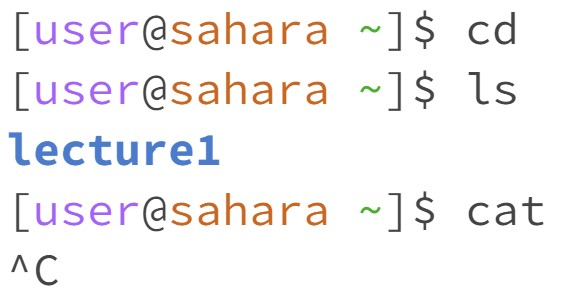
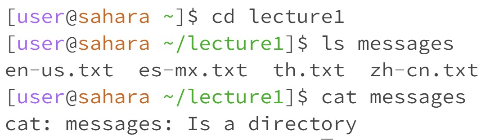
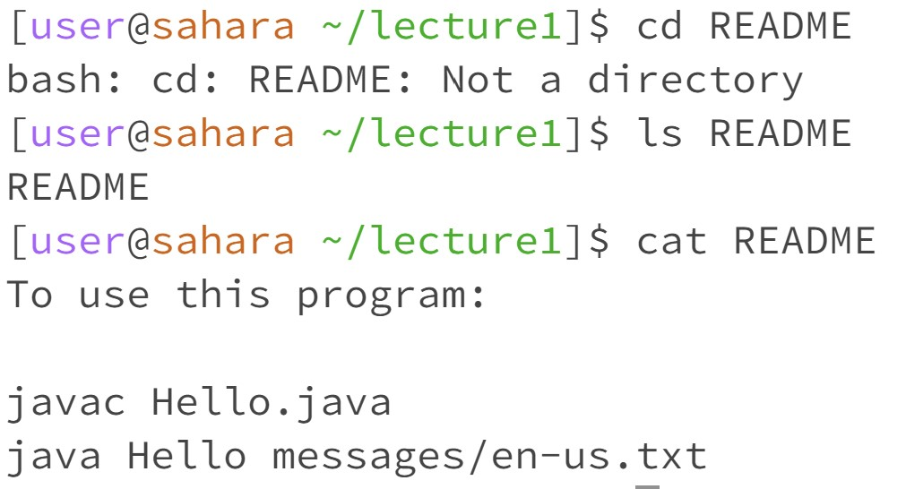

1. Share an example of using the command with no arguments.

The directory of question 1 is "/home".

-The "cd" is used to change the directory, but since I didn't command with an argument, it will go back to the previous folder, and the direction in Q1 is /Home, so it won't change direction. This isn't an error.

-The "ls" is used to show the names of the files and folders inside the current working directory, so it showed "lecture1". This isn't an error.

-The "cat" is used to show the contents of one or more files given by the paths. Since I didn't make an argument, it doesn't show anything and lets me enter something. I use Ctrl+C to continue. This is an error because it has nothing to print.

2. Share an example of using the command with a path to a directory as an argument.

The directory of question 2 is "/home/lecture1".

-"cd lecture1": This isn't an error, it changes the direction to /lecture1.

-"ls messages": This isn't an error because "messages" is a directory, so it showed the names inside the messages directory. 

-"cat messages": This is an error because "messages" isn't a file, it's a directory, so it showed "Is a directory". 

3. Share an example of using the command with a path to a file as an argument.

The directory of question 2 is "/home/lecture1".

-"cd README": This is an error because README isn't a directory; it's a file, so it showed as "Not a directory".

-"ls README": This isn't an error, because README is a file, so it showed the "README".

-"cat README" This isn't an error, and it showed the contents of the README file.
