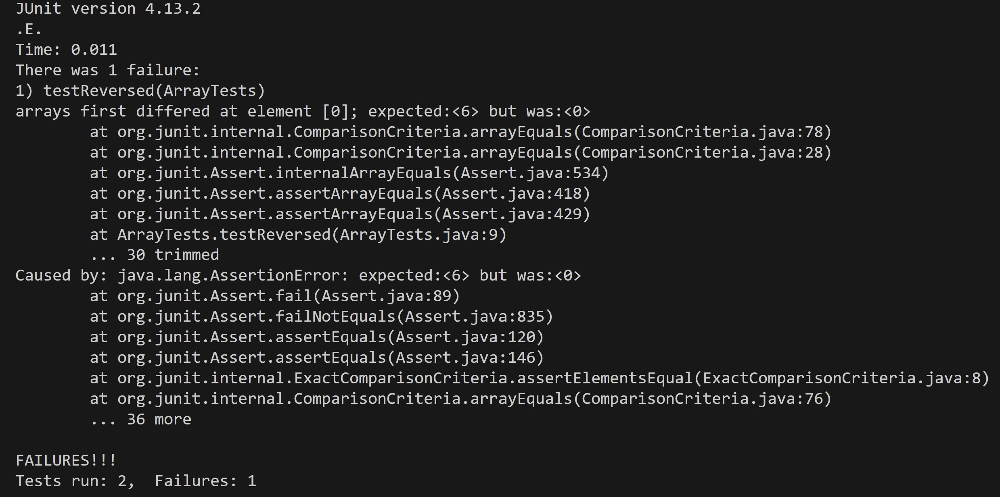
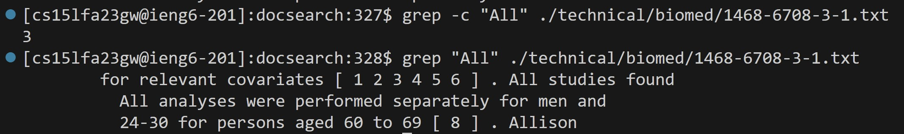
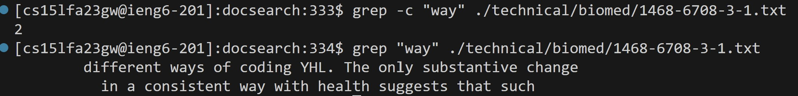
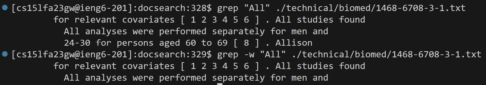
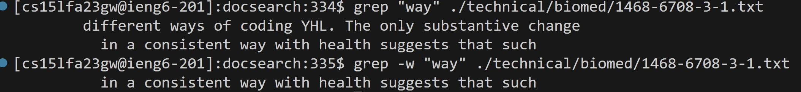
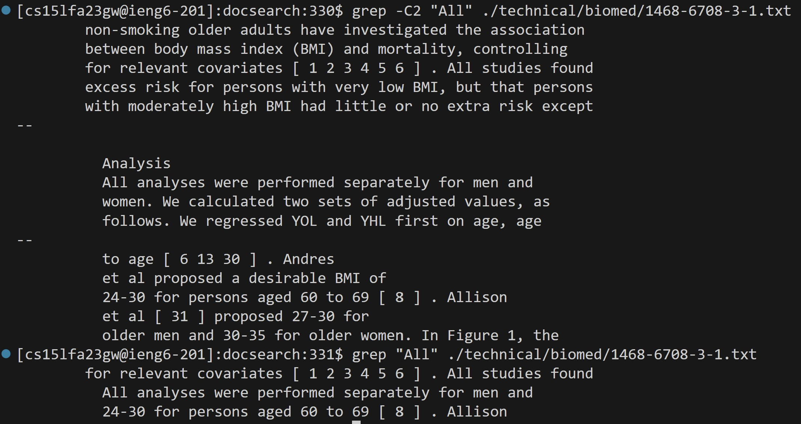
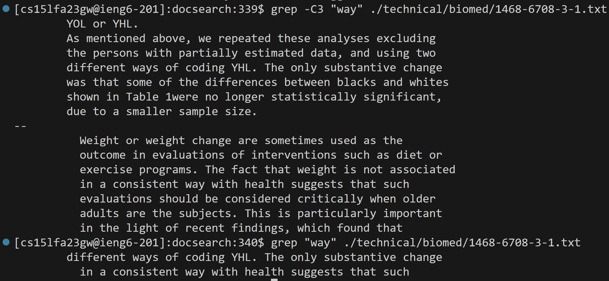
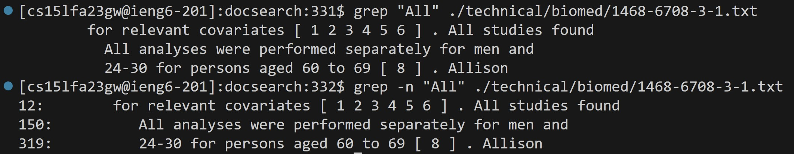
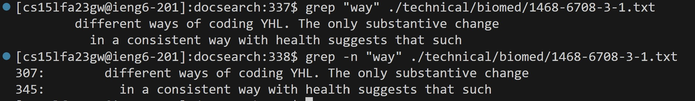

Part 1

A failure-inducing input for the buggy program, 
as a JUnit test and any associated code:

```
  @Test
  public void testReversed() {
    int[] input1 = { 4, 8, 5, 6};
    assertArrayEquals(new int[]{6, 5, 8, 4}, ArrayExamples.reversed(input1));
  }
```


An input that doesn’t induce a failure,
as a JUnit test and any associated code 

```
 @Test
  public void testReversed() {
    int[] input1 = { };
    assertArrayEquals(new int[]{ }, ArrayExamples.reversed(input1));
  }
```

The symptom, as the output of running the tests 


The bug, as the before-and-after code change required to fix it

Before:

``` 
static int[] reversed(int[] arr) {
    int[] newArray = new int[arr.length];
    for(int i = 0; i < arr.length; i += 1) {
      arr[i] = newArray[arr.length - i - 1];
    }
    return arr;
  }
```

After:

```
    static int[] reversed(int[] arr) {
    int[] newArray = new int[arr.length];
    for(int i = 0; i < arr.length; i += 1) {
      newArray[i] = arr[arr.length - i - 1];
    }
    return newArray;
  }
```

Before the change, the code tries to make ```arr``` 
equal to the flipped ```newArray```. But the ```newArray``` 
doesn't have any content inside it, it only has 
the same length as ```arr```. Only ```arr``` has content 
inside. So it should be ```newArray``` as the save place 
to store the flipped ```arr```.


Part 2

``` grep -c``` 

The ```grep``` command is used to search for patterns in text.

The ```-c``` option is used to count the number of lines that match the pattern.

```grep -c "All" ./technical/biomed/1468-6708-3-1.txt```

The string ```All``` matches in 3 lines in technical/biomed/1468-6708-3-1.txt and outputs the number of lines that match the “All”.

```grep -c "way" ./technical/biomed/1468-6708-3-1.txt```

The string ```way``` matches in 2 lines in technical/biomed/1468-6708-3-1.txt and outputs the number of lines that match the “way”.


```grep -w```

The ```grep``` command is used to search for patterns in text.

The ```-w``` option is used to search patterns in the text. And make sure that it is matching a complete word, not a part of it. Then print the line of the matching line

```grep -w "All" ./technical/biomed/1468-6708-3-1.txt```

Search for the whole word ```All``` in technical/biomed/1468-6708-3-1.txt and print that line.


```grep -w "way" ./technical/biomed/1468-6708-3-1.txt```

Search for the whole word ```way``` in technical/biomed/1468-6708-3-1.txt and print that line.


```grep -C ()```

The ```grep``` command is used to search for patterns in text.

The ```-C (number) ``` option is used to search for pattern in the text and print the matching line and before and after to a few lines.

```grep -C2 "All" ./technical/biomed/1468-6708-3-1.txt```

Search for ```All``` in technical/biomed/1468-6708-3-1.txt and print that line and its before two lines and after two lines.

``` grep -C3 "way" ./technical/biomed/1468-6708-3-1.txt```

Search for ```way``` in technical/biomed/1468-6708-3-1.txt and print that line and its before three lines and after three lines.


```grep -n```

The ```grep``` command is used to search for patterns in text.

The ```-n``` option is used to search for pattern in the text and print the line number and line of the matching line.

```grep -n "All" ./technical/biomed/1468-6708-3-1.txt```

Search for ```All``` in technical/biomed/1468-6708-3-1.txt and print the line number and line of the matching line.


```grep -n "All" ./technical/biomed/1468-6708-3-1.txt```

Search for ```way``` in technical/biomed/1468-6708-3-1.txt and print the line number and line of the matching line.
