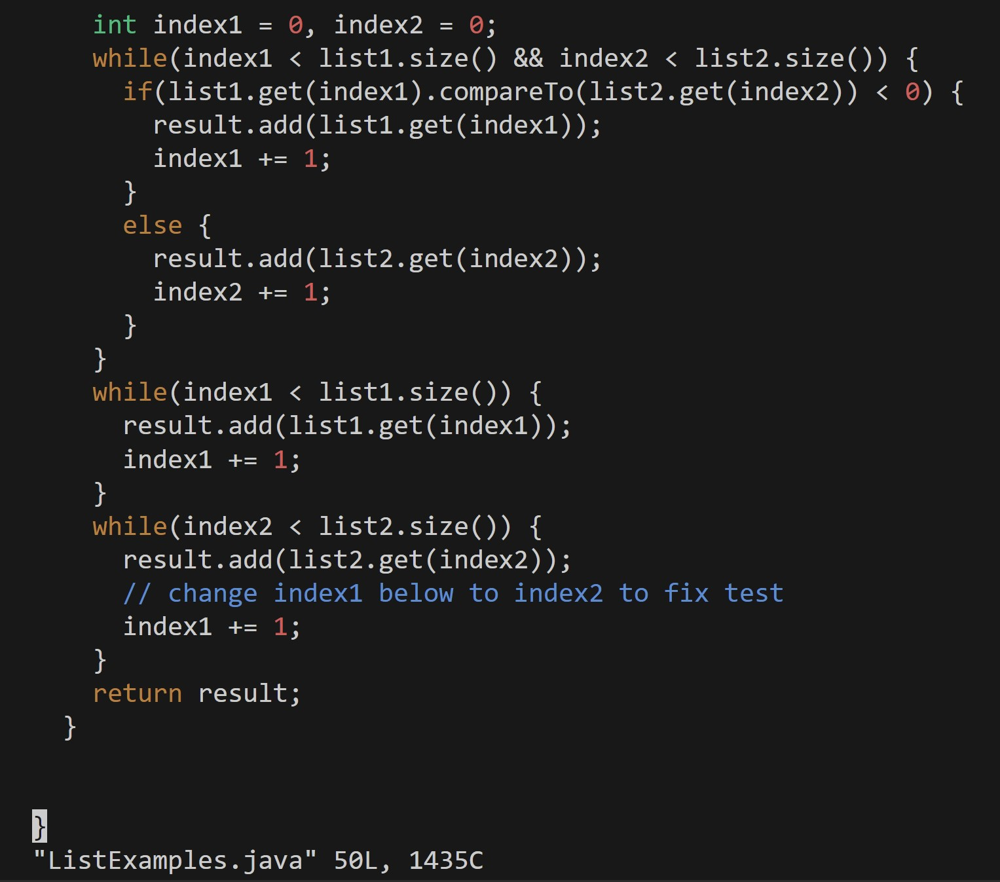

Step 4: Log into ieng6

Step 5: Clone your fork of the repository from your Github account (using the SSH URL)

Step 6: Run the tests, demonstrating that they fail

Step 7: Edit the code file ListExamples.java to fix the failing test (as a reminder, the error in the code is just that index1 is used instead of index2 in the final loop in merge)

Step 8: Run the tests, demonstrating that they now succeed

Step 9: Commit and push the resulting change to your Github account

