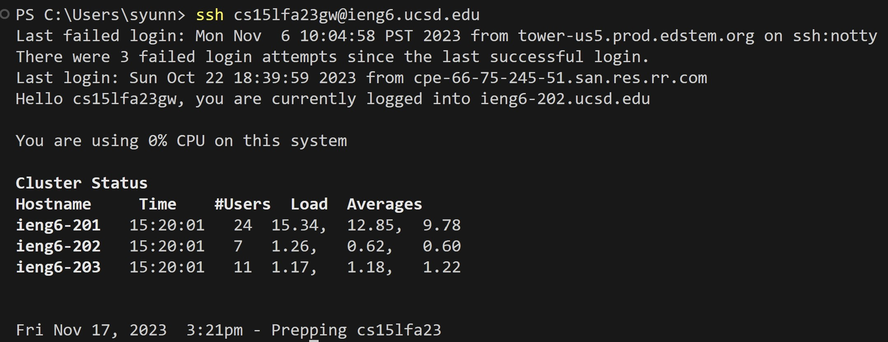
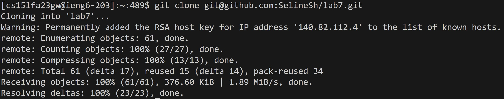
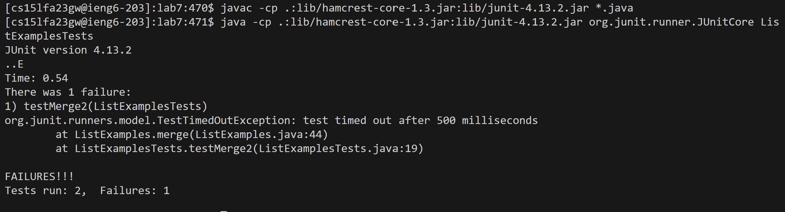
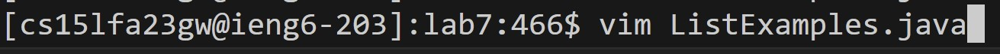
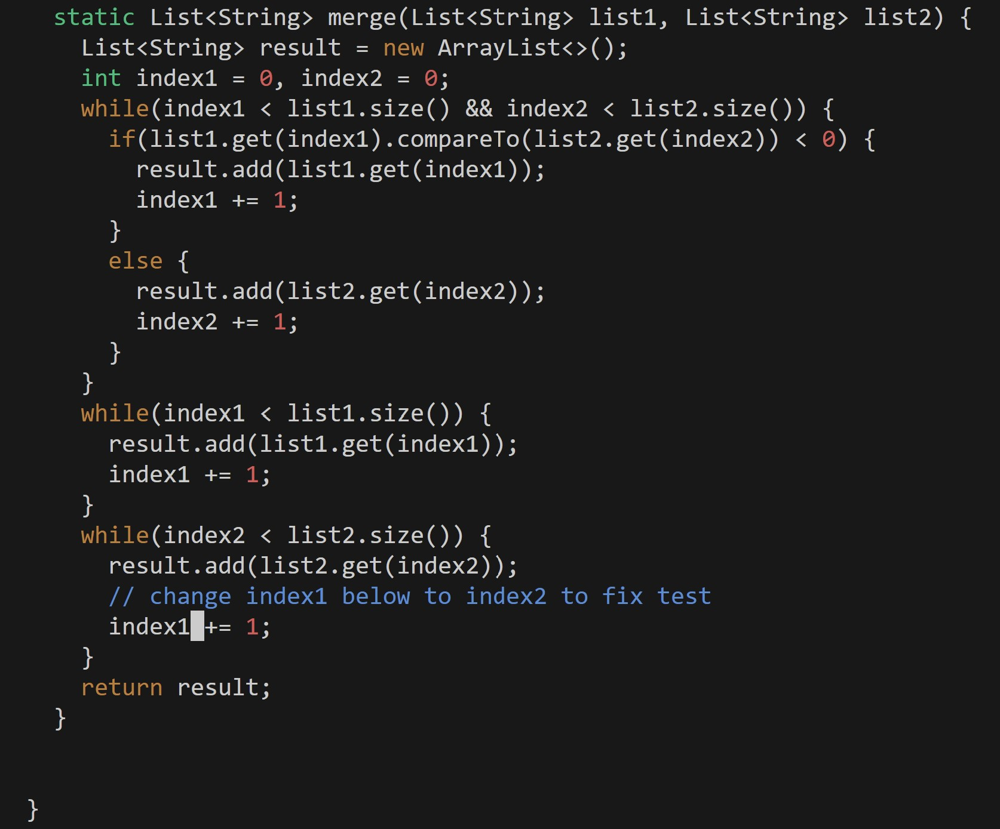
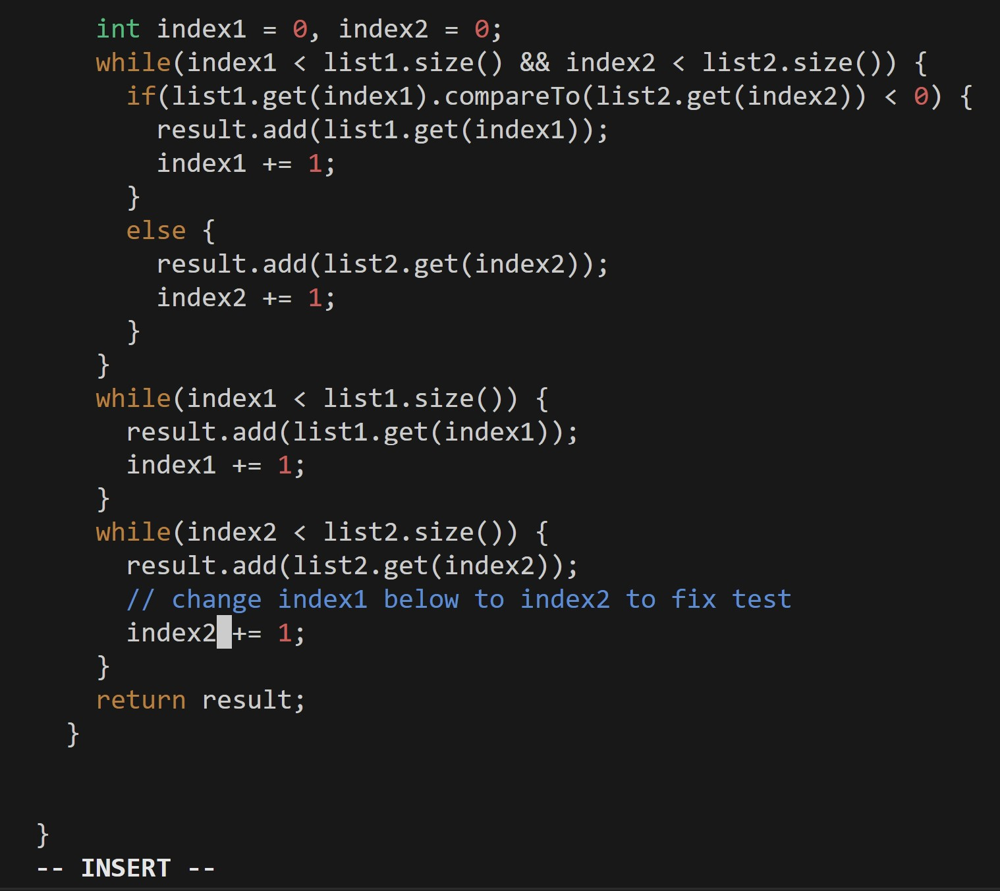
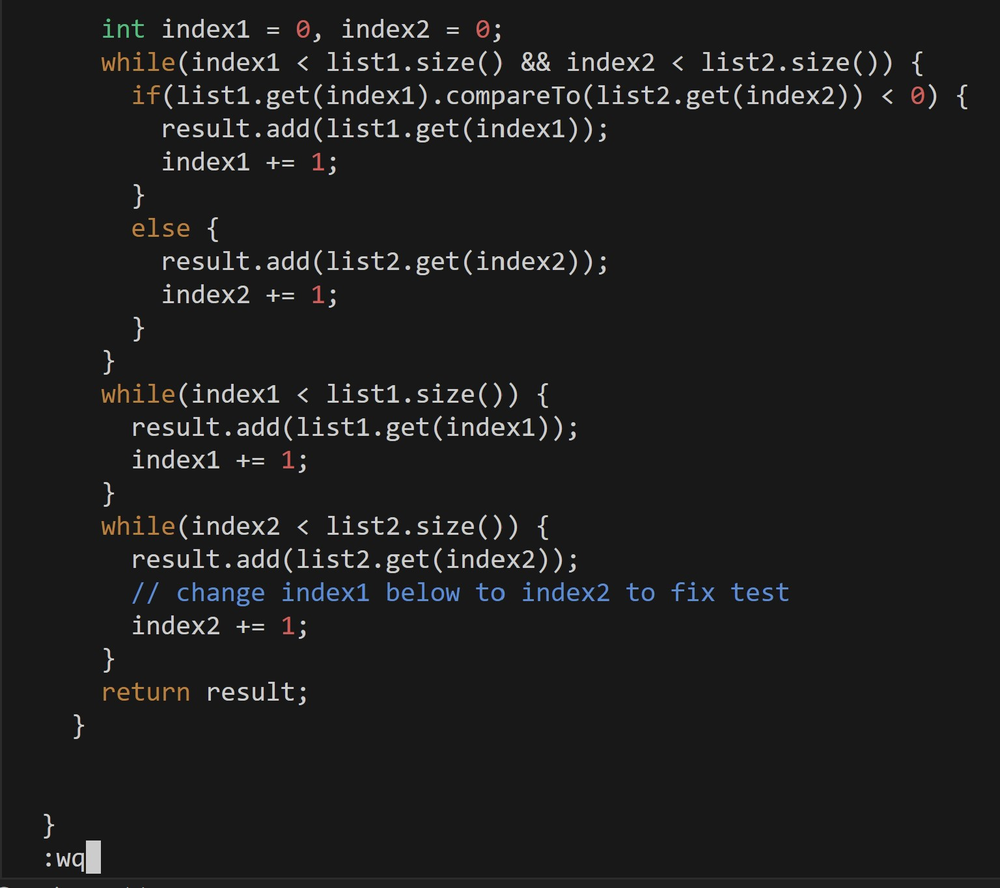
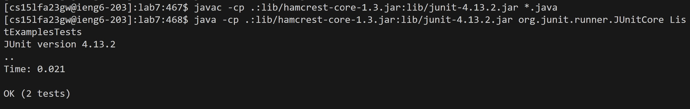
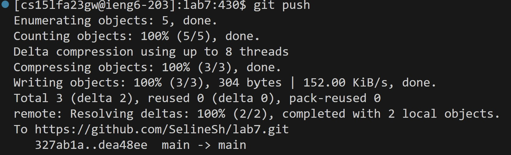
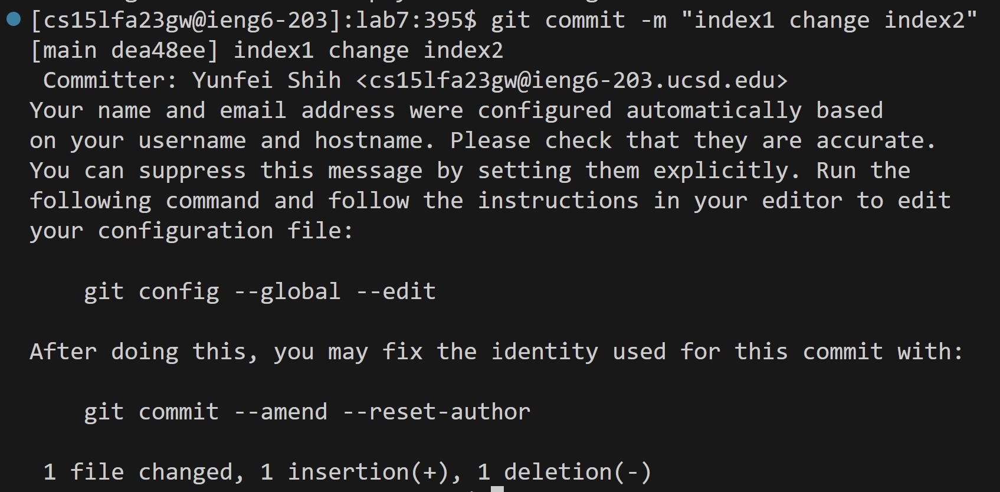

Step 4: Log into ieng6

Keys pressed: ```ssh cs15lfa23gw@ieng6.ucsd.edu <enter>``` to login my ieng6 account.

Step 5: Clone your fork of the repository from your Github account (using the SSH URL)

Keys pressed: ```git clone git@github.com:SelineSh/lab7.git <enter>``` to clone

Step 6: Run the tests, demonstrating that they fail

Keys pressed: ```javac -cp .:lib/hamcrest-core-1.3.jar:lib/junit-4.13.2.jar *.java <enter>``` and then ```java -cp .:lib/hamcrest-core-1.3.jar:lib/junit-4.13.2.jar org.junit.runner.JUnitCore ListExamplesTests <enter>``` to run the tests.


Step 7: Edit the code file ListExamples.java to fix the failing test (as a reminder, the error in the code is just that index1 is used instead of index2 in the final loop in merge)

Keys pressed: ```vim ListExamples.java <enter>``` to open ListExamples.java


Keys pressed: ```<up><up><up><up><up><up><up>``` + ```<left><left><left><left><left><left><left>``` move to 44,13, behind the ```index1```


Keys pressed:  ```i``` change to INSERT mode

Keys pressed: ``` <backspace> 2``` to change ```index1``` to ```index2``` 


```<esc> : (````<shift> + ;````)  w  q ``` to save and exit. ```w```is save, ```q``` is exit.


Step 8: Run the tests, demonstrating that they now succeed

Keys pressed: ```<up><up><enter>``` to find and run ```javac -cp .:lib/hamcrest-core-1.3.jar:lib/junit-4.13.2.jar *.java```, since it's in the last two histories, I use the ```<up><up>``` to access it. And then  ```<up><up><enter>``` to find and run the tests ```java -cp .:lib/hamcrest-core-1.3.jar:lib/junit-4.13.2.jar org.junit.runner.JUnitCore ListExamplesTests```,since after run ```javac -cp .:lib/hamcrest-core-1.3.jar:lib/junit-4.13.2.jar *.java```, it's in the last two histories, I use the ```<up><up>``` to access it.

Step 9: Commit and push the resulting change to your Github account

Keys pressed: ```git push <enter>``` to push

Keys pressed: ```git commit -m + "message" <enter>``` to comiit message
