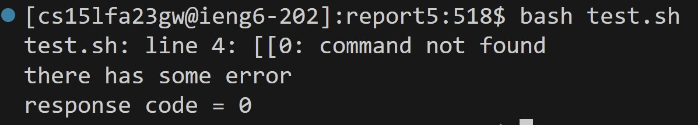
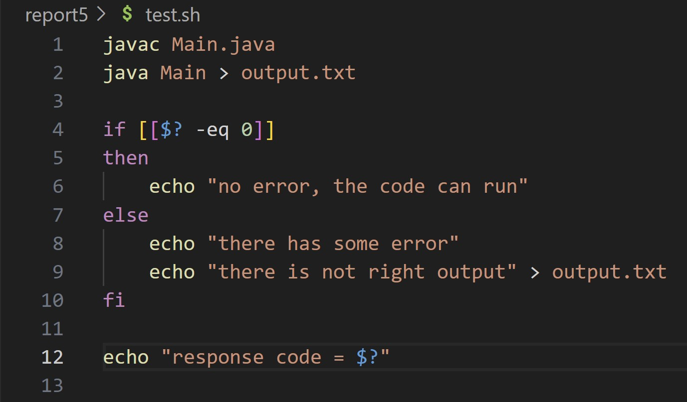
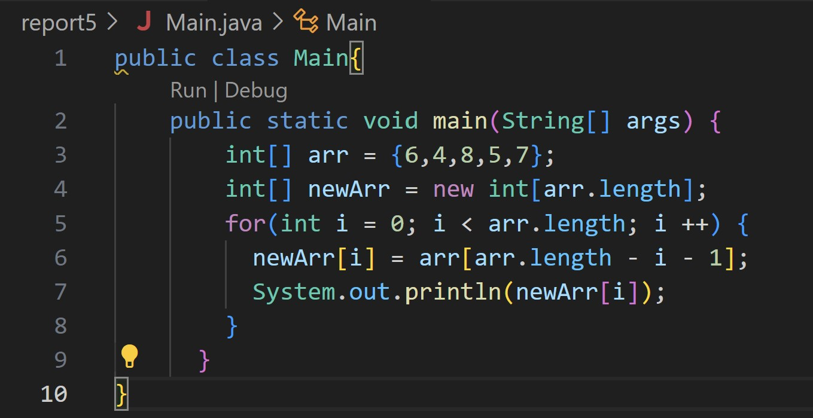
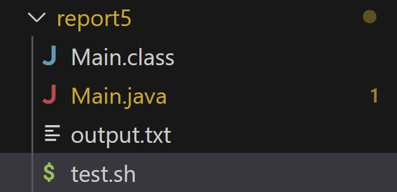
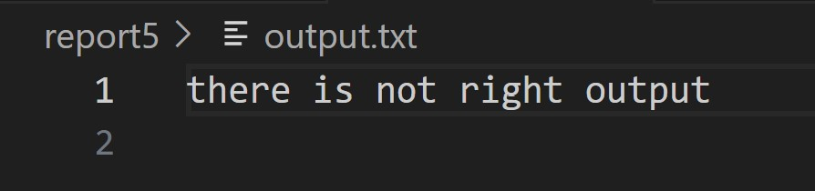
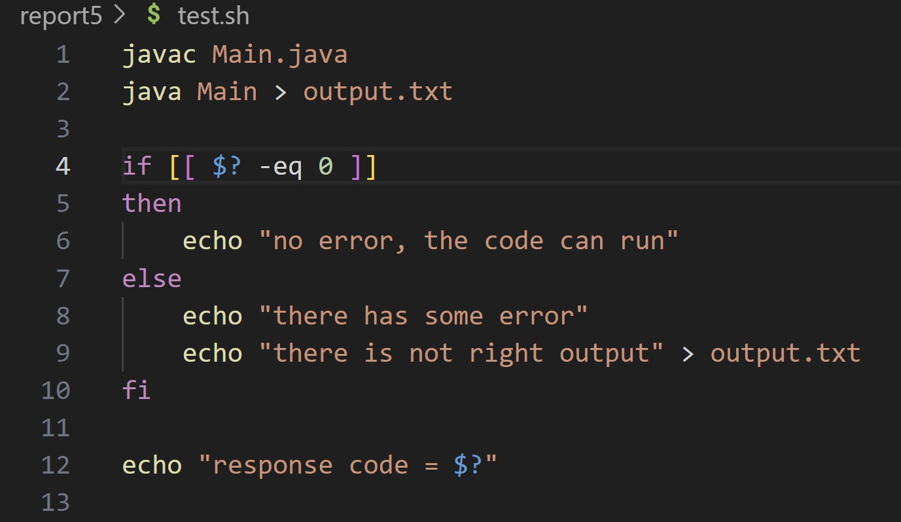
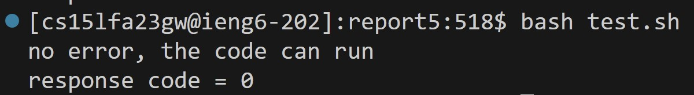
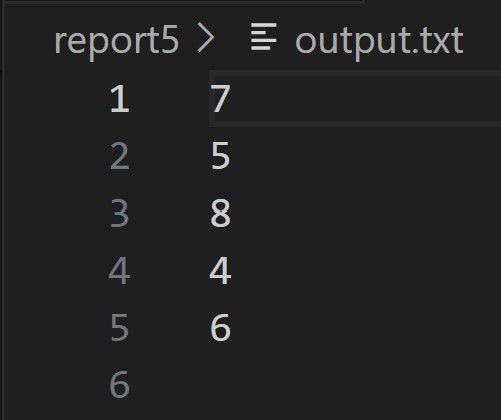
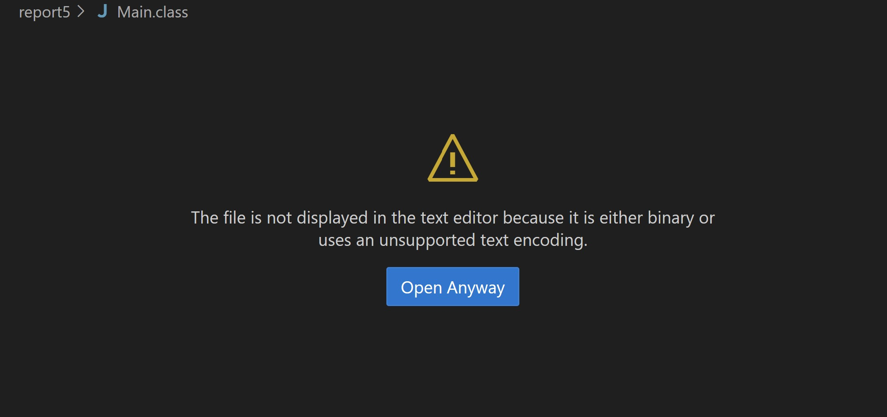

Part 1 - Debugging Scenario:

1. The original post from a student with a screenshot showing a symptom and 
a description of a guess at the bug/some sense of what the 
failure-inducinginput is. (Don’t actually make the post! Just write 
the content that would go in such a post)


Hello, I seem to have some problems with my bash script, my response code 
is clearly 0, it should print "no error, the code can run". But it ends 
up showing "there has some error". Here is a screenshot of my output.


Is it because I can't just use ```$? -eq 0```, I need to set ```$?``` first?
Here is my bash script ```test.sh``` and I have attached my Main.java in 
case there is something wrong with my ```Main.java```:




Also, here is the directory where I ran ```bash test.sh```, and 
```output.txt```



2. A response from a TA asking a leading question or suggesting
a command to try (To be clear, you are mimicking a TA here.)

Hi, I noticed that there is no problem with your ```Main.java```, 
as you said the problem is in ```test.sh```. But the problem is not in 
setting ```$?``` , the problem is in your ```if [[$? -eq 0]]```, you can review
the following handout from week 5, and you will find the cause of
the problem. I hope it will help you.

3. Another screenshot/terminal output showing what information the student
 got from trying that, and a clear description of what the bug is.

I found the problem, thanks. I have forgotten to include the space inside the ```[[]]```. This caused an error in my condition.

Here is my new ```test.sh``` , ```output```and ```output.txt```.




4. At the end, all the information needed about the setup including:

The file & directory structure needed

Here is the directory structure, where the original files are 
```test.sh```, and ```Main.java```.


The contents of each file before fixing the bug

Here's each file before the bug was fixed




The full command line (or lines) you ran to trigger the bug
Running ```bash test.sh```  to trigger the bug. Here is the screenshot


A description of what to edit to fix the bug

The error is in ```test.sh``` ```if [[$? -eq 0]]```. There needs to be a space
after ```[[```, and ```0```. So that the condition can be implemented correctly.

Part 2 - Reflection:

I learned a lot about ```vim```. Previously I only knew how to use ```wq``` to save exit and ```i``` to modify. 
This made me not very like to use ```vim```. But then I realized that there are a lot of commands available that 
can be used, and that using these commands can make it easier 
to use ```vim```, which I think will save me a lot of time if I need to use ```vim``` in my future courses.
